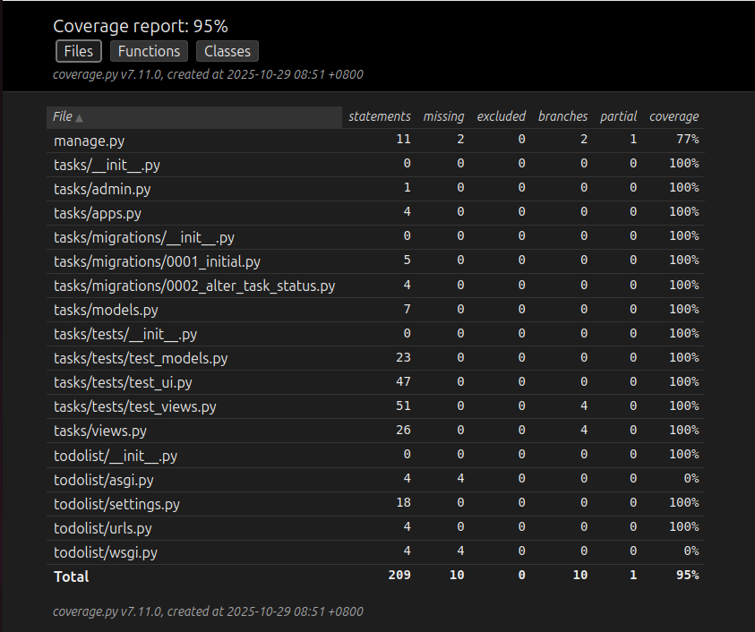

# todolist
## 動機
- 練習 django
- 練習 unit test
- 練習 selenium 做自動化測試
- 練習在 linux 環境下開發

## 用到的技術
- python 
- django
- sqlite
- unit test
- selenium
- coverage

## 建立環境(linux)
1. open terminal
2. type ```mkdir todolist```
3. type ```cd todolist```
4. type ```git clone https://github.com/PigIsCute/todolist.git```
5. type ```cd todolist```
6. type ```./build_env.sh```

## 執行程式
1. type ```source myenv/bin/activate```
2. type ```cd todolist```
3. type ```python3 manage.py runserver 0.0.0.0:8080```
4. open firfox and type ```127.0.0.1:8080```

## 測試結果
- 

## demo
https://www.youtube.com/watch?v=SC6ski5EqWU&list=PLxulyTJjjPJK3LnrEWN5_RFv8c7oQfpFF